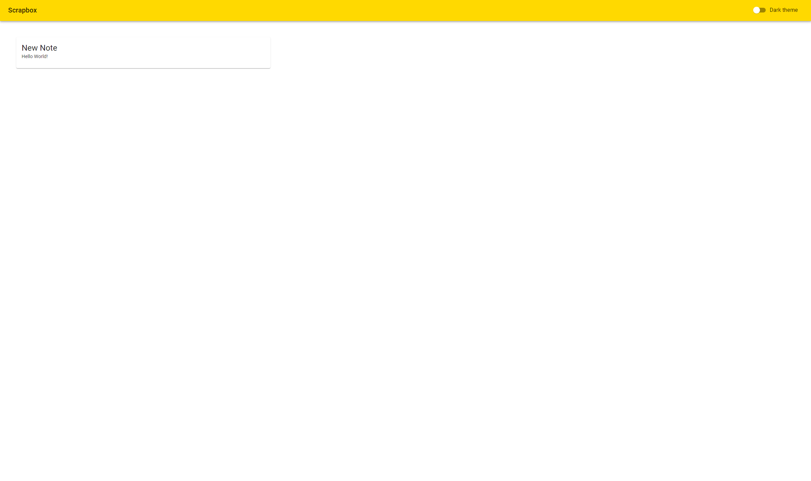
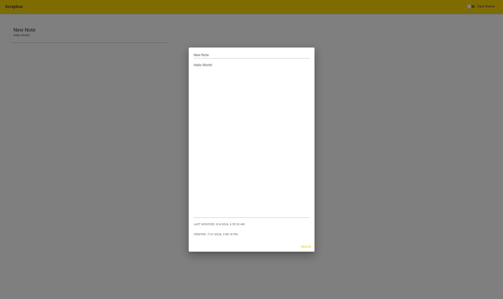

# MSA 2024 Phase 2 - Software Stream

# ScrapBox

## Introduction
ScrapBox is a web app that can be used to quickly make notes and save ideas. It is designed to be easily self hostable on your network using Docker and shared with family and friends. It is build with Vite, React, and ASP.NET Core.

### Basic and Advanced Features
#### Basic Features
 - React project using TypeScript
 - Used Material UI for the UI
 - Responsive design
 - React Router
 - Git for version control
 - Backend built in C# using .NET 8.0
 - Usage of EFCore
 - Persistence using SQLite
 - CRUD operations
#### Advanced Features
 - Dockerized
 - State management using Hookstate
 - Theme switching

 ### Something I am proud of
 This is an app that (with a bit more work) I could see myself using in my day to day life. I have always wanted a fast note taking app that I could host myself.cd ..

## Screenshots

## Building and Running

### Building the frontend

Go to /ScrapBox/frontend/Services/ScrapletService.ts and change the URL to the address of the server you are hosting the backend container on.

Then run `npm install` then `npm run build` in the frontend directory to build the frontend.

### Building the backend

I could not get Visual Studio to build the backend in a way that would work properly. This could be due to my choice to use Alpine Linux as the base image for the backend container. JetBrains Rider was able to build the backend properly, presumably because it allowed me to compile with `musl` instead of `glibc`. I have included the compiled backend in the backend directory.

### Running with Docker

A `compose.yaml` file is included in the root directory. Run `docker-compose up -d` to build and start the backend and frontend containers. The frontend will be available at `http://<your-docker-host>:3000`.

